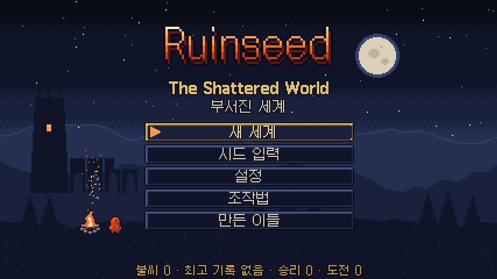
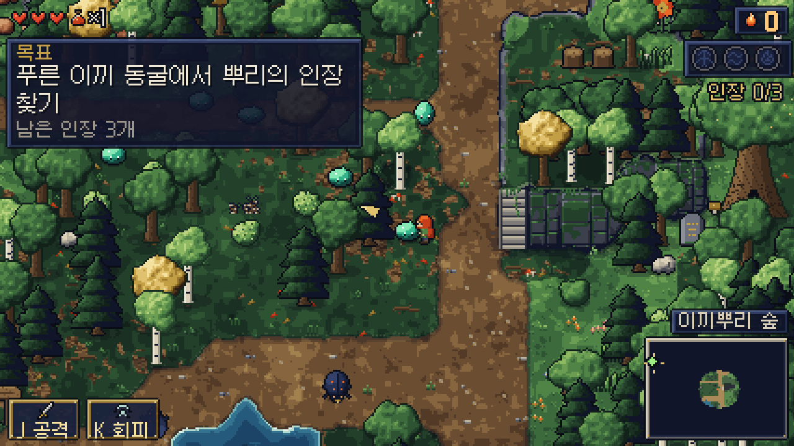
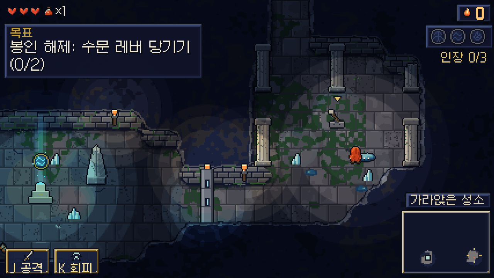
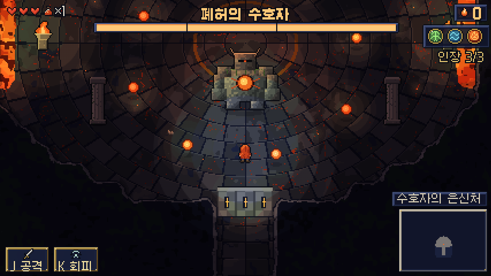
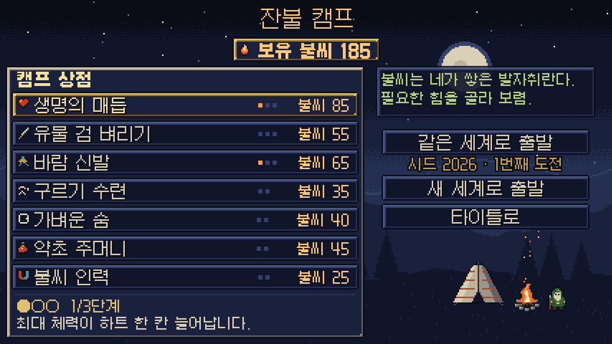
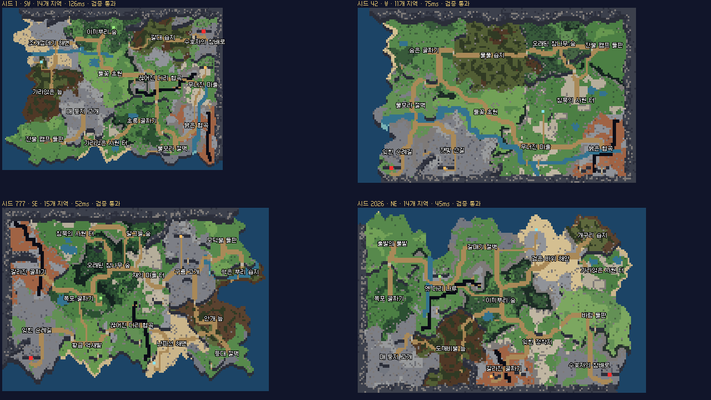

# Ruinseed: The Shattered World

브라우저에서 바로 실행되는 한국어 픽셀아트 액션 어드벤처입니다.
시드마다 새로 만들어지는 세계를 탐험하고, 던전 세 곳에서 인장을 모아 폐허의 수호자를 쓰러뜨리세요.

**▶ 바로 플레이: <https://legerdo.github.io/Ruinseed/>**



## 실행하기

위 링크(GitHub Pages)에서 바로 플레이하거나, 저장소를 받아 `index.html`을 브라우저로 열면 됩니다. 설치나 빌드는 필요 없습니다.

- Chrome, Edge 최신 버전에서 확인했습니다.
- 정적 파일만 쓰므로 다른 정적 호스팅에 그대로 올려도 됩니다.
- 불씨, 강화, 설정, 최고 기록은 브라우저의 localStorage에 저장됩니다.
- 소리는 첫 입력(키, 클릭, 게임패드) 뒤에 켜집니다.

## 조작

| 동작 | 키보드 · 마우스 | 게임패드 |
| --- | --- | --- |
| 이동 | WASD / 방향키 | 왼쪽 스틱 / 방향 패드 |
| 공격 | J / Z / 마우스 왼쪽 | X |
| 회피 (구르는 동안 무적) | K / X / Shift / 마우스 오른쪽 | B |
| 상호작용 · 대화 넘기기 | E / 스페이스 / Enter | A |
| 회복약 | Q / R | Y |
| 지도 | M / Tab | Back |
| 일시정지 | Esc / P | Start |

## 게임 흐름

1. 잔불 캠프에서 캠프지기 마루와 이야기하면 던전 위치가 지도에 표시됩니다.
2. 푸른 이끼 동굴, 가라앉은 성소, 잿불 심연에서 봉인을 풀고 인장을 얻습니다.
3. 인장 세 개를 모으면 수호자의 은신처 문이 열립니다.
4. 폐허의 수호자를 쓰러뜨리면 승리입니다. 쓰러져도 모은 불씨로 캠프에서 영구 강화를 살 수 있습니다.

한 번 클리어하는 데 10~15분 정도 걸리도록 설계했습니다.

## 특징

- **시드 기반 세계**: 숲, 초원, 해안 절벽, 습지, 협곡, 산길, 폐허 같은 지역이 지형으로 이어집니다. 같은 시드는 항상 같은 세계가 되고, 도전할 때마다 적과 보상 배치만 달라집니다.
- **생성 후 검증**: 안전한 시작점, 모든 지역의 연결, 던전 세 곳과 인장, 수호자 방까지 가는 길을 확인하고, 문제가 있으면 보정하거나 다시 만듭니다.
- **던전 세 종류**: 화로에 불 밝히기, 수문 레버 당기기, 시련의 방 돌파처럼 던전마다 봉인을 푸는 방법이 다릅니다.
- **보스전**: 공격 예고, 돌진, 투사체, 소환, 약점 노출, 체력에 따른 단계 변화가 있습니다.
- **외부 에셋 없음**: 그래픽, 음악, 효과음을 모두 코드로 만들어 냅니다. 외부에서 가져온 것은 한글 비트맵 글꼴(갈무리)뿐입니다.
- **치트**: 설정 → 치트(디버그)에서 무적 모드, 불씨 100개 받기, 수호자에게 바로 가기를 쓸 수 있습니다.

## 스크린샷

| 숲 | 던전 |
| --- | --- |
|  |  |
| **폐허의 수호자** | **잔불 캠프 상점** |
|  |  |

시드마다 달라지는 세계 (시드 1, 42, 777, 2026):



## 폴더 구조

```text
index.html          게임 (배포용, GitHub Pages가 이 파일을 엽니다)
dev.html            개발용 빌드: 테스트 장면과 자동화 훅 포함
favicon.png         탭 아이콘 (게임 속 잉걸의 인장 스프라이트)
css/                페이지 스타일
fonts/              갈무리 글꼴 라이선스 (SIL OFL 1.1)
js/main.js          시작점: 정수 배율 캔버스, 고정 스텝 루프, 장면 관리
js/core/            입력, 저장, 오디오 합성, 비트맵 글꼴 렌더러, 유틸리티
js/art/             픽셀아트 절차 생성: 지형, 자연물, 구조물, 캐릭터, 적
js/world/           세계 · 던전 생성과 검증
js/game/            게임 규칙: 플레이어, 적, 보스, HUD, 조명, 한국어 문자열
js/ui/              UI 요소, 모달, 장면 (타이틀 · 캠프 · 승리 · 패배)
js/dev/             개발용 장면과 자동 플레이 봇 (dev.html에서만 불러옴)
tools/              개발 도구: 글꼴 변환, 헤드리스 스크린샷과 자동 검증
tools/jobs/         검증 시나리오 (화면 크기, 저장 손상, 오디오, 자동 플레이 등)
docs/screenshots/   README 이미지
```

## 개발

게임 자체에는 런타임 의존성이 없습니다. `tools/`의 개발 도구에는 Node.js와 Chrome(또는 Edge)이 필요합니다.

```bash
cd tools
npm install                           # playwright-core 설치
node shot.mjs jobs/playthrough.json   # 자동 플레이 봇이 시드 9개를 승리까지 진행
node shot.mjs jobs/sizes.json         # 여러 화면 크기의 UI 스크린샷
```

- 스크린샷은 `tools/shots/`에 저장됩니다. 브라우저를 찾지 못하면 `CHROME_PATH` 환경 변수로 경로를 지정하세요.
- 한국어 문자열을 바꾼 뒤에는 글꼴 데이터를 다시 만드세요. 처음 한 번 `npm run fetch-font`로 갈무리 원본을 받은 다음 `npm run font`를 실행하면 됩니다.
- `dev.html` 주소 예: `dev.html?scene=play&seed=42`, `dev.html?scene=worldpreview&seeds=1,2,3,4&scale=1`
- README 이미지는 `node shot.mjs jobs/readme.json`으로 다시 찍어 `docs/screenshots/`에 복사합니다.

## 크레딧

- 원본 기획 프롬프트: [FrostSource/8bit-ai-arena — PROMPT.md](https://github.com/FrostSource/8bit-ai-arena/blob/master/PROMPT.md)
- 글꼴: [갈무리(Galmuri)](https://github.com/quiple/galmuri) © 이민서, SIL Open Font License 1.1

자세한 내용은 [CREDITS.md](CREDITS.md)에 있습니다.
